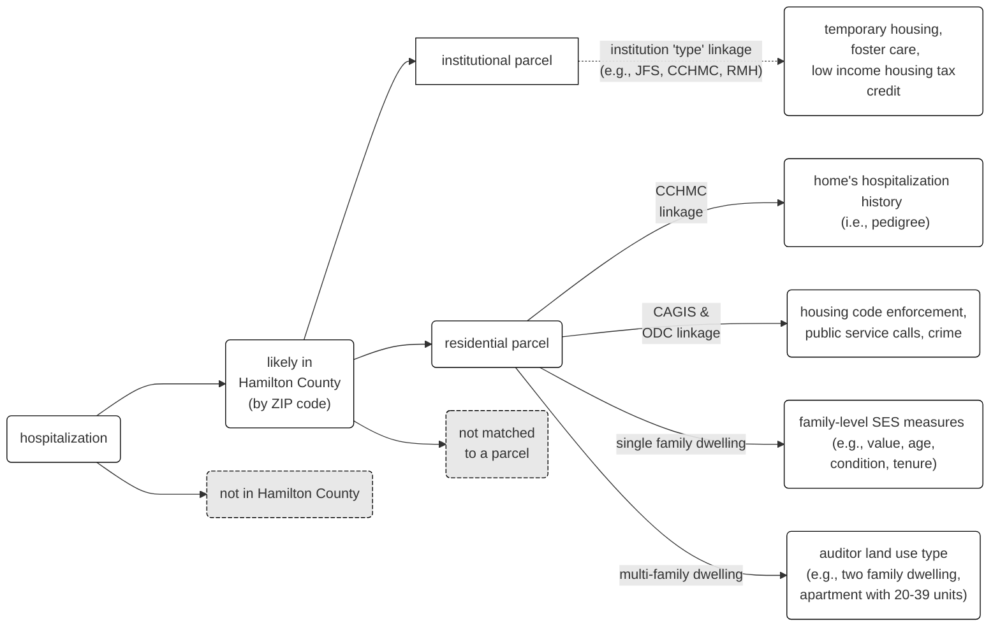

<!-- README.md is generated from README.Rmd. Please edit that file -->

```{r, include = FALSE}
library(parcel)

knitr::opts_chunk$set(
  collapse = TRUE,
  comment = "#>",
  fig.path = "man/figures/README-",
  out.width = "100%"
)
```

# parcel

<!-- badges: start -->
[](https://github.com/geomarker-io/parcel/actions/workflows/R-CMD-check.yaml)
<!-- badges: end -->


The goal of parcel is to provide tools for matching real-world addresses to reference sets of addresses; e.g., "352 Helen Street", "352 Helen St." or "352 helen st". This package is motivated by the included example data resources of auditor parcel tax data from Hamilton County, Ohio. Use `get_parcel_data()` to get the corresponding parcel data for a vector of addresses:

```{r}
get_parcel_data(
  c("1069 Overlook Avenue Cincinnati OH 45238",
    "419 Elm St. Cincinnati OH 45238",
    "3333 Burnet Ave Cincinnati OH 45219",
    "3830 President Drive Cincinnati Ohio 45225",
    "3544 Linwood Av Cincinnati OH 45226")
)
```

With this specific goal in mind, parcel includes:

- functions for cleaning and tagging components of addresses: **`clean_address()`**, **`tag_address()`**, and **`create_address_stub()`**
- the `cagis_parcels` tabular-data-resource, which contains parcel identifiers, parcel addresses, and parcel characteristics downloaded from the [Cincinnati Area Geographic Information System (CAGIS)](https://cagismaps.hamilton-co.org/cagisportal/mapdata/download) 
- the `hamilton_online_parcels` tabular-data-resource, which contains parcel characteristics scraped from [Hamilton County Auditor Online](https://wedge1.hcauditor.org/)
- functions for joining addresses to parcel identifiers based on an included model pretrained on electronic health record addresses in Hamilton County, OH and a list of custom pseudo-identifiers for multi-building apartment complexes: **`link_parcel()`**, **`link_apt()`**


## Installation

{parcel} requires the `usaddress` python module for tagging addresses and creating address stubs, as well as the `dedupe` and `dedupe-variable-address` python modules for matching addresses, all of which can be installed from inside R with:

```{r}
#| eval: false
reticulate::py_install("usaddress", pip = TRUE)
reticulate::py_install("dedupe", pip = TRUE)
reticulate::py_install("dedupe-variable-address", pip = TRUE)
```

The development version of parcel can be installed with:

```{r}
#| eval: false
pak::pak("geomarker-io/parcel")
```

### Python, `miniconda`, and `virtualenv`

`reticulate::py_install()` assumes a non-system version of Python is already installed and will offer to install Miniconda and create an environment specifically for R and the reticulate package.

As an alternative to miniconda, it is possible to create a virtualenv using reticulate:

```{r}
#| eval: false
library(reticulate)
install_python("3.9.12")
virtualenv_create("r-parcel", version = "3.9.12")
use_virtualenv("r-parcel")
py_install("usaddress", pip = TRUE)
py_module_available("usaddress")
```

To help R find this virtualenv for every session, either `use_virtualenv("r-parcel")` should be run in every R session *or*, better yet, by setting the `RETICULATE_PYTHON` environment variable in a user- or project-specific `.Renviron` file. You can check on which python installation chosen to be used by reticulate and why by using:

```{r}
#| eval: false
reticulate::py_config()
reticulate::py_list_packages()
```

## Identifiers for Parcels and Properties

A `parcel_id` refers to the Hamilton County Auditor's "Parcel Number", which is referred to as the "Property Number" within the CAGIS Open Data and uniquely identifies properties. In rare cases, multple addresses can share the same parcel boundaries, but have unique `parcel_id`s and in these cases, their resulting centroid coordinates would also be identical.

Within the process of matching to a parcel, an individual address could be merged with differing types and resolutions of data:



### Non-Residential Parcels

Known non-residential addresses will be matched and returned with a special parcel identifer denoting that the matched parcel is non-residential; e.g., Cincinnati Children's Hospital Medical Center, Jobs and Family Services, Ronald McDonald House):

```{r}
get_parcel_data(
  c("222 E Central Parkway Cincinnati Ohio 45220",
    "222 central pkwy Cincinnati Ohio 45220",
    "3333 Burnet Ave Cincinnati Ohio 45219",
    "3333 Burnet Avenue Cincinnati Ohio 45219",
    "350 Erkenbrecher Ave Cincinnati Ohio 45219")
) |>
  dplyr::select(input_address, parcel_id)
```

### Condominiums

Because "second line" address components (e.g., "Unit 2B") are not captured, a single address can refer to multiple parcels in the case of condos or otherwise shared building ownership. For example, the address "323 Fifth St" has six distinct `parcel_id`s, each with different home values and land uses:

|parcel_id   | market_total_value|land_use                    |
|:-----------|------------------:|:---------------------------|
|14500010321 |             397500|condominium unit            |
|14500010317 |             123000|condominium office building |
|14500010320 |             180000|condominium unit            |
|14500010319 |             255000|condominium unit            |
|14500010322 |             388230|condominium unit            |
|14500010318 |             239500|condominium unit            |

In this case, a special parcel identifier `TIED_MATCH` is returned to denote that the address matched more than one parcel:

```{r}
get_parcel_data("323 Fifth St W Cincinnati OH 45202")$parcel_id
```

### Large Apartment Complexes

Large apartment complexes often use multiple mailing addresses that are not the same as the parcel address(es). In these special cases, `link_apt()` is used to match addresses exactly based on their street name if the street number falls within a certain range:

```{r}
str(parcel:::apt_defs)
```

```{r}
get_parcel_data("5377 Bahama Ter Cincinnati Ohio 45223")$parcel_id
```

## CAGIS Parcels Data

The `cagis_parcels` tabular data resource (TDR) is created using the R scripts in `/inst` and stored within the package. It can be loaded using {[`fr`](https://github.com/cole-brokamp/fr)}:

```{r}
d_parcel <- fr::read_fr_tdr(fs::path_package("parcel", "cagis_parcels"))

d_parcel

d_parcel@schema

# without fr:
# read.csv(fs::path_package("parcel", "cagis_parcels"))
```

Auditor parcel-level data were excluded if they (1) did not contain a parcel identifier, (2) did not contain a property address number/name, or (3) had a duplicated parcel identifier.

Parcels with the following land use categories are included in the data resource and others are excluded.  These were selected to reflect *residential* usages of parcels.

```{r}
library(dplyr, warn.conflicts = FALSE)

d_parcel |>
  group_by(land_use) |>
  summarize(n_parcels = n()) |>
  arrange(desc(n_parcels)) |>
  knitr::kable()
```

Some of the parcel characteristics do not make sense in certain contexts and should not be interpreted incorrectly; for example, the value of a parcel for a multi-family or multi-unit housing structure shouldn't be compared to the value of a parcel for a single-family household for the purposes of assesing individual-level SES. 

## Hamilton County Auditor Online Data

The `hamilton_online_parcels` TDR is created by linking a saved scraping of the [auditor's website](https://wedge1.hcauditor.org/) to the parcel identifiers in the `cagis_parcels` TDR.

Similarly, the `hamilton_online_parcel` TDR is created using the R scripts in `/inst` and stored within the package. It can be loaded using {[`fr`](https://github.com/cole-brokamp/fr)}:

```{r}
d_online <- fr::read_fr_tdr(fs::path_package("parcel", "hamilton_online_parcels"))

d_online

d_online@schema

# without fr:
# read.csv(fs::path_package("parcel", "hamilton_online_parcels"))
```

## Estimating the number of households per parcel

Certain calculations needs to be weighted by households instead of parcel; e.g. "What fraction of families live near roadway in Avondale?".  We assume the following as a conservative estimate of the number of households per parcel for each `land_use` code:

|`land_use`                        |n households|
|:-------------------------------|------:|
|single family dwelling          |1|
|condominium unit                |1|
|two family dwelling             |2|
|three family dwelling           |3|
|apartment, 4-19 units           |4|
|apartment, 20-39 units          |20|
|apartment, 40+ units            |40|
|landominium                     |1|
|charities, hospitals, retir     |1|
|condo or pud garage             |1|
|metropolitan housing authority  |1|
|office / apartment over         |1|
|manufactured home               |1|
|other commercial housing        |1|
|nursing home / private hospital |1|
|mobile home / trailer park      |1|
|single fam dw 0-9 acr           |1|
|independent living (seniors)    |1|
|lihtc res                       |1|
|condominium office building     |0|
|other residential structure     |0|
|boataminium                     |0|

