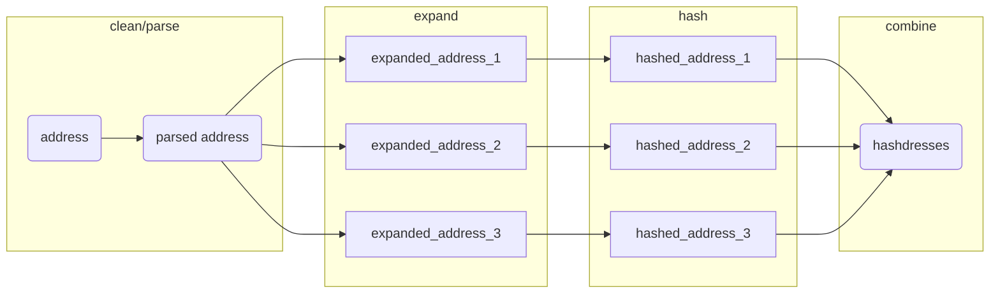

# parcel

<!-- badges: start -->
[](https://github.com/geomarker-io/parcel/actions/workflows/R-CMD-check.yaml)
<!-- badges: end -->

> This package relies on system calls to [Docker](https://www.docker.com/), which must be installed and available.

The goal of parcel is to provide tools for matching real-world addresses to reference sets of addresses. 

Address matching is completed by calculating the "hashdress", in which an address is cleaned, parsed into components, combined into a "parsed_address", and 'expanded' into all possible addresses based on abbreviations. (See the [DeGAUSS](https://degauss.org) [postal](https://github.com/degauss-org/postal#geomarker-methods) container for details.) The cleaned, parsed, and expanded addresses are then each hashed to create a unique set of hashdress identifers for a specific address, termed "hashdresses":



This allows the matching of an address like "352 Helen Street" to "352 Helen St." or "352 helen st". This type of address matching can be used to match addresses in collected data to a set of addresses with parcel identifiers obtained from a county auditor, or other open/commercial datasets describing the conditions specific to a parcel of land.

With this specific goal in mind, parcel includes:

- **`hashdress()`**: a function to clean, normalize, expand, and hash addresses 
- **`cagis_hashdresses`**: a reference address-parcel set of hashdresses for Hamilton County, OH
- **`add_parcel_id()`**: a function to directly add parcel identifers to addresses in Hamilton County, OH based on the parsed street number and street name 
- **`cagis_parcels`**: parcel-specific county auditor tax data that can be linked using the parcel identifier

## Installation

You can install the development version of parcel like so:

``` r
renv::install("geomarker-io/parcel")
```

## Example

``` r
library(parcel)

data.frame(address = c(
  "3937 Rose Hill Ave Cincinnati OH 45229",
  "424 Klotter Ave Cincinnati OH 45214",
  "3328 Bauerwoods Dr Cincinnati OH 45251"
)) |>
  add_parcel_id() |>
  tidyr::unnest(cols = c(parcel_id))

#> parsing addresses...
#> expanding addresses...
#> # A tibble: 3 × 14
#> address     parce…¹ prope…² prope…³ prope…⁴ marke…⁵ land_…⁶ acreage homes…⁷ RED_2…⁸ annua…⁹ unpai…˟ parce…˟ parce…˟
#> <chr>       <chr>   <chr>   <chr>   <chr>     <dbl> <fct>     <dbl> <lgl>   <lgl>     <dbl>   <dbl>   <dbl>   <dbl>
#> 1 3937 Rose … 111000… 3937    ROSE H… AV       366930 single…   0.437 FALSE   TRUE      8772.       0   -84.5    39.2
#> 2 424 Klotte… 096000… 424     KLOTTER AV        75000 reside…   0.103 FALSE   FALSE     1874.       0   -84.5    39.1
#> 3 3328 Bauer… 510009… 3328    BAUERW… DR       189990 two fa…   0.467 FALSE   TRUE      5413.       0   -84.6    39.2
#> # … with abbreviated variable names ¹​parcel_id, ²​property_addr_number, ³​property_addr_street, ⁴​property_addr_suffix,
#> #   ⁵​market_total_value, ⁶​land_use, ⁷​homestead, ⁸​RED_25_FLAG, ⁹​annual_taxes, ˟​unpaid_taxes, ˟​parcel_centroid_lon,
#> #   ˟​parcel_centroid_lat
```

