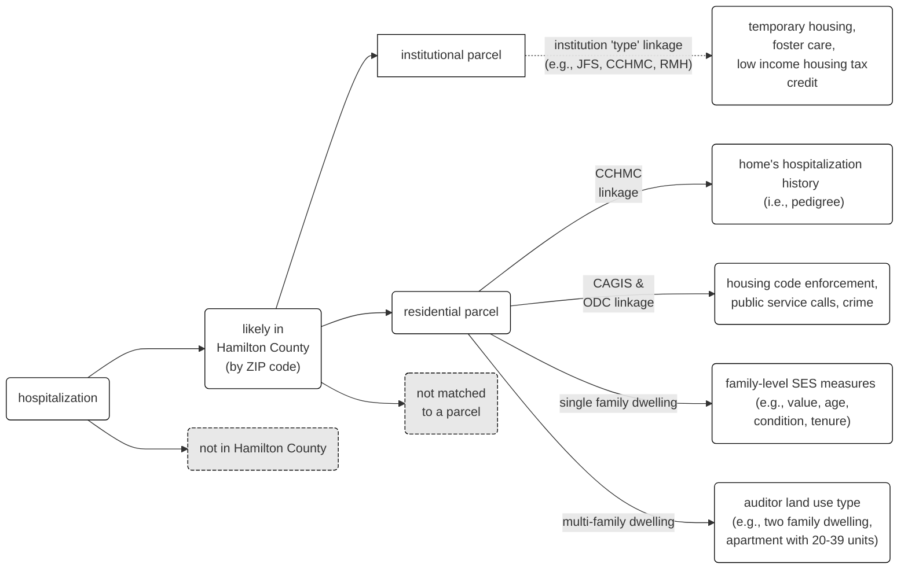

<!-- README.md is generated from README.Rmd. Please edit that file -->

# parcel

<!-- badges: start -->

[](https://github.com/geomarker-io/parcel/actions/workflows/R-CMD-check.yaml)
<!-- badges: end -->

The goal of parcel is to provide tools for matching real-world addresses
to reference sets of addresses; e.g., “352 Helen Street”, “352 Helen
St.” or “352 helen st”. This package is motivated by the included
example data resources of auditor parcel tax data from Hamilton County,
Ohio. Use `get_parcel_data()` to get the corresponding parcel data for a
vector of addresses:

``` r
get_parcel_data(
  c("1069 Overlook Avenue Cincinnati OH 45238",
    "419 Elm St. Cincinnati OH 45238",
    "3333 Burnet Ave Cincinnati OH 45219",
    "3830 President Drive Cincinnati Ohio 45225",
    "3544 Linwood Av Cincinnati OH 45226")
)
#> # A tibble: 5 × 22
#>   input_address        parcel_id  score centroid_lat centroid_lon parcel_address
#>   <chr>                <chr>      <dbl>        <dbl>        <dbl> <chr>         
#> 1 1069 Overlook Avenu… 1800A800…  0.795         39.1        -84.6 1069 OVERLOOK…
#> 2 419 Elm St. Cincinn… 54000410…  0.860         39.1        -84.6 419 ELM ST    
#> 3 3333 Burnet Ave Cin… nonres-c…  0.860         NA           NA   <NA>          
#> 4 3830 President Driv… president NA             NA           NA   <NA>          
#> 5 3544 Linwood Av Cin… 01900010…  0.860         39.1        -84.4 3544 LINWOOD …
#> # ℹ 16 more variables: parcel_addr_number <chr>, parcel_addr_street <chr>,
#> #   parcel_addr_suffix <chr>, land_use <fct>, condo_id <chr>, condo_unit <chr>,
#> #   market_total_value <dbl>, acreage <dbl>, homestead <lgl>,
#> #   rental_registration <lgl>, year_built <dbl>, n_total_rooms <dbl>,
#> #   n_bedrooms <dbl>, n_full_bathrooms <dbl>, n_half_bathrooms <dbl>,
#> #   online_market_total_value <dbl>
```

With this specific goal in mind, parcel includes:

- functions for cleaning and tagging components of addresses:
  **`clean_address()`**, **`tag_address()`**, and
  **`create_address_stub()`**
- the `cagis_parcels` tabular-data-resource, which contains parcel
  identifiers, parcel addresses, and parcel characteristics downloaded
  from the [Cincinnati Area Geographic Information System
  (CAGIS)](https://cagismaps.hamilton-co.org/cagisportal/mapdata/download)
- the `hamilton_online_parcels` tabular-data-resource, which contains
  parcel characteristics scraped from [Hamilton County Auditor
  Online](https://wedge1.hcauditor.org/)
- functions for joining addresses to parcel identifiers based on an
  included model pretrained on electronic health record addresses in
  Hamilton County, OH and a list of custom pseudo-identifiers for
  multi-building apartment complexes: **`link_parcel()`**,
  **`link_apt()`**

## Installation

The development version of parcel can be installed with:

``` r
pak::pak("geomarker-io/parcel")
```

{parcel} requires the `usaddress` python module for tagging addresses
and creating address stubs, as well as the `dedupe` and
`dedupe-variable-address` python modules for matching addresses, all of
which can be installed to an existing python environment from inside R
using [reticulate](https://rstudio.github.io/reticulate/index.html):

``` r
reticulate::py_install("usaddress", pip = TRUE)
reticulate::py_install("dedupe", pip = TRUE)
reticulate::py_install("dedupe-variable-address", pip = TRUE)
```

If there is no
[preconfigured](https://rstudio.github.io/reticulate/articles/versions.html)
or compatible version of Python already available on the system,
Miniconda will be installed and the required Python packages will be
installed in the standard shared environment for R sessions (typically a
virtual environment, or a Conda environment named “r-reticulate”) after
`library(parcel)` is called.

## Identifiers for Parcels and Properties

A `parcel_id` refers to the Hamilton County Auditor’s “Parcel Number”,
which is referred to as the “Property Number” within the CAGIS Open Data
and uniquely identifies properties. In rare cases, multple addresses can
share the same parcel boundaries, but have unique `parcel_id`s and in
these cases, their resulting centroid coordinates would also be
identical.

Within the process of matching to a parcel, an individual address could
be merged with differing types and resolutions of data:



### Non-Residential Parcels

Known non-residential addresses will be matched and returned with a
special parcel identifer denoting that the matched parcel is
non-residential; e.g., Cincinnati Children’s Hospital Medical Center,
Jobs and Family Services, Ronald McDonald House):

``` r
get_parcel_data(
  c("222 E Central Parkway Cincinnati Ohio 45220",
    "222 central pkwy Cincinnati Ohio 45220",
    "3333 Burnet Ave Cincinnati Ohio 45219",
    "3333 Burnet Avenue Cincinnati Ohio 45219",
    "350 Erkenbrecher Ave Cincinnati Ohio 45219")
) |>
  dplyr::select(input_address, parcel_id)
#> # A tibble: 5 × 2
#>   input_address                               parcel_id     
#>   <chr>                                       <chr>         
#> 1 222 E Central Parkway Cincinnati Ohio 45220 nonres-jfs    
#> 2 222 central pkwy Cincinnati Ohio 45220      nonres-jfs    
#> 3 3333 Burnet Ave Cincinnati Ohio 45219       nonres-cchmc  
#> 4 3333 Burnet Avenue Cincinnati Ohio 45219    nonres-cchmc  
#> 5 350 Erkenbrecher Ave Cincinnati Ohio 45219  nonres-rmh-350
```

### Condominiums

Because “second line” address components (e.g., “Unit 2B”) are not
captured, a single address can refer to multiple parcels in the case of
condos or otherwise shared building ownership. For example, the address
“323 Fifth St” has six distinct `parcel_id`s, each with different home
values and land uses:

| parcel_id   | market_total_value | land_use                    |
|:------------|-------------------:|:----------------------------|
| 14500010321 |             397500 | condominium unit            |
| 14500010317 |             123000 | condominium office building |
| 14500010320 |             180000 | condominium unit            |
| 14500010319 |             255000 | condominium unit            |
| 14500010322 |             388230 | condominium unit            |
| 14500010318 |             239500 | condominium unit            |

In this case, a special parcel identifier `TIED_MATCH` is returned to
denote that the address matched more than one parcel:

``` r
get_parcel_data("323 Fifth St W Cincinnati OH 45202")$parcel_id
#> [1] "TIED_MATCHES"
```

### Large Apartment Complexes

Large apartment complexes often use multiple mailing addresses that are
not the same as the parcel address(es). In these special cases,
`link_apt()` is used to match addresses exactly based on their street
name if the street number falls within a certain range:

``` r
str(parcel:::apt_defs)
#> List of 9
#>  $ president  :List of 3
#>   ..$ street_name: chr [1:2] "president drive" "president dr"
#>   ..$ range_low  : num 3000
#>   ..$ range_high : num 4999
#>  $ tower      :List of 3
#>   ..$ street_name: chr [1:4] "east tower drive" "east tower dr" "e tower drive" "e tower dr"
#>   ..$ range_low  : num 2000
#>   ..$ range_high : num 29999
#>  $ bahama     :List of 3
#>   ..$ street_name: chr [1:4] "bahama terrace" "bahama te" "bahama ter" "bahama terr"
#>   ..$ range_low  : num 5000
#>   ..$ range_high : num 5999
#>  $ hawaiian   :List of 3
#>   ..$ street_name: chr [1:4] "hawaiian terrace" "hawaiian te" "hawaiian ter" "hawaiian terr"
#>   ..$ range_low  : num 4000
#>   ..$ range_high : num 5999
#>  $ dewdrop    :List of 3
#>   ..$ street_name: chr [1:2] "dewdrop circle circle" "dewdrop circle cir"
#>   ..$ range_low  : num 400
#>   ..$ range_high : num 599
#>  $ winneste   :List of 3
#>   ..$ street_name: chr [1:3] "winneste avenue" "winneste ave" "winneste av"
#>   ..$ range_low  : num 4000
#>   ..$ range_high : num 5999
#>  $ walden_glen:List of 3
#>   ..$ street_name: chr [1:2] "walden glen circle" "walden glen cir"
#>   ..$ range_low  : num 2000
#>   ..$ range_high : num 2999
#>  $ clovernook :List of 3
#>   ..$ street_name: chr [1:3] "clovernook avenue" "clovernook ave" "clovernook av"
#>   ..$ range_low  : num 7000
#>   ..$ range_high : num 7999
#>  $ nottingham :List of 3
#>   ..$ street_name: chr [1:4] "nottingham road" "nottingham rd" "nottingham drive" "nottingham dr"
#>   ..$ range_low  : num 2000
#>   ..$ range_high : num 2999
```

``` r
get_parcel_data("5377 Bahama Ter Cincinnati Ohio 45223")$parcel_id
#> [1] "bahama"
```

## CAGIS Parcels Data

The `cagis_parcels` tabular data resource (TDR) is created using the R
scripts in `/inst` and stored within the package. It can be loaded using
{[`fr`](https://github.com/cole-brokamp/fr)}:

``` r
d_parcel <- fr::read_fr_tdr(fs::path_package("parcel", "cagis_parcels"))

d_parcel
#> cagis_parcels
#> - version: 0.11.0
#> - title: CAGIS Parcels
#> - homepage: <https://github.com/geomarker-io/hamilton_parcels>
#> - description: A curated property-level data resource derived from the Hamilton
#> County, OH Auditor data distributed through CAGIS Open Data:
#> https://cagismaps.hamilton-co.org/cagisportal/mapdata/download
#> # A tibble: 259,653 × 14
#>    parcel_id     centroid_lat centroid_lon parcel_address    parcel_addr_number
#>    <chr>                <dbl>        <dbl> <chr>             <chr>             
#>  1 6210023015500         39.3        -84.3 184 CANNONADE DR  184               
#>  2 6210023017000         39.3        -84.3 154 THOROBRED RD  154               
#>  3 6210023017700         39.3        -84.3 112 CITATION CT   112               
#>  4 6210023018100         39.3        -84.3 119 CITATION CT   119               
#>  5 6210023018500         39.3        -84.3 112 THOROBRED RD  112               
#>  6 6210023020300         39.3        -84.3 242 CORDERO TL    242               
#>  7 6210023020500         39.3        -84.3 254 CORDERO TL    254               
#>  8 6210023022800         39.3        -84.3 212 RIVA RIDGE CT 212               
#>  9 6210023023100         39.3        -84.3 230 RIVA RIDGE CT 230               
#> 10 6210023023300         39.3        -84.3 242 RIVA RIDGE CT 242               
#> # ℹ 259,643 more rows
#> # ℹ 9 more variables: parcel_addr_street <chr>, parcel_addr_suffix <chr>,
#> #   land_use <fct>, condo_id <chr>, condo_unit <chr>, market_total_value <dbl>,
#> #   acreage <dbl>, homestead <lgl>, rental_registration <lgl>

d_parcel@schema
#> parcel_id
#> - type: string
#> - description: uniquely identifies properties; the auditor Parcel Number
#> centroid_lat
#> - type: number
#> - description: calculated as centroid of casted multipolygon geometry and
#> projected from Ohio South to WGS84
#> centroid_lon
#> - type: number
#> - description: calculated as centroid of casted multipolygon geometry and
#> projected from Ohio South to WGS84
#> parcel_address
#> - type: string
#> - description: derived by pasting parcel_address_{number, street, suffix}`
#> together
#> parcel_addr_number
#> - type: string
#> parcel_addr_street
#> - type: string
#> parcel_addr_suffix
#> - type: string
#> land_use
#> - type: string
#> - constraints: enum = apartment, 4-19 units, apartment, 20-39 units, apartment,
#> 40+ units, mobile home / trailer park, other commercial housing, office /
#> apartment over, single family dwelling, two family dwelling, three family
#> dwelling, condominium unit, boataminium, condo or pud garage, landominium,
#> manufactured home, lihtc res, other residential structure, and metropolitan
#> housing authority
#> condo_id
#> - type: string
#> - description: used to match two parcels to the same building of condos
#> condo_unit
#> - type: string
#> market_total_value
#> - type: number
#> acreage
#> - type: number
#> homestead
#> - type: boolean
#> rental_registration
#> - type: boolean

# without fr:
# read.csv(fs::path_package("parcel", "cagis_parcels"))
```

Auditor parcel-level data were excluded if they (1) did not contain a
parcel identifier, (2) did not contain a property address number/name,
or (3) had a duplicated parcel identifier.

Parcels with the following land use categories are included in the data
resource and others are excluded. These were selected to reflect
*residential* usages of parcels.

``` r
library(dplyr, warn.conflicts = FALSE)

d_parcel |>
  group_by(land_use) |>
  summarize(n_parcels = n()) |>
  arrange(desc(n_parcels)) |>
  knitr::kable()
```

| land_use                       | n_parcels |
|:-------------------------------|----------:|
| single family dwelling         |    212995 |
| condominium unit               |     20325 |
| two family dwelling            |     11331 |
| apartment, 4-19 units          |      5654 |
| landominium                    |      3049 |
| three family dwelling          |      1854 |
| condo or pud garage            |      1063 |
| other residential structure    |       869 |
| metropolitan housing authority |       744 |
| apartment, 40+ units           |       619 |
| apartment, 20-39 units         |       458 |
| manufactured home              |       204 |
| office / apartment over        |       187 |
| boataminium                    |       141 |
| other commercial housing       |        95 |
| mobile home / trailer park     |        40 |
| lihtc res                      |        25 |

Some of the parcel characteristics do not make sense in certain contexts
and should not be interpreted incorrectly; for example, the value of a
parcel for a multi-family or multi-unit housing structure shouldn’t be
compared to the value of a parcel for a single-family household for the
purposes of assesing individual-level SES.

## Hamilton County Auditor Online Data

The `hamilton_online_parcels` TDR is created by linking a saved scraping
of the [auditor’s website](https://wedge1.hcauditor.org/) to the parcel
identifiers in the `cagis_parcels` TDR.

Similarly, the `hamilton_online_parcel` TDR is created using the R
scripts in `/inst` and stored within the package. It can be loaded using
{[`fr`](https://github.com/cole-brokamp/fr)}:

``` r
d_online <- fr::read_fr_tdr(fs::path_package("parcel", "hamilton_online_parcels"))

d_online
#> hamilton_online_parcels
#> - version: 0.11.0
#> - title: Hamilton Online Parcels
#> - homepage: <https://github.com/geomarker-io/parcel>
#> - description: A curated property-level data resource derived from scraping the
#> Hamilton County, OH Auditor Online: https://wedge1.hcauditor.org/. Data was
#> scraped for only residential parcels in CAGIS Parcels; see homepage for
#> details.
#> # A tibble: 259,653 × 7
#>    parcel_id     year_built n_total_rooms n_bedrooms n_full_bathrooms
#>    <chr>              <dbl>         <dbl>      <dbl>            <dbl>
#>  1 6210023015500       1990             8          4                3
#>  2 6210023017000       1990             7          3                2
#>  3 6210023017700       1991             8          4                2
#>  4 6210023018100       1991             9          4                2
#>  5 6210023018500       1990             5          3                2
#>  6 6210023020300       1991             9          4                3
#>  7 6210023020500       1992             8          4                2
#>  8 6210023022800       1992             8          4                2
#>  9 6210023023100       1992             6          2                3
#> 10 6210023023300       1992             7          3                2
#> # ℹ 259,643 more rows
#> # ℹ 2 more variables: n_half_bathrooms <dbl>, online_market_total_value <dbl>

d_online@schema
#> parcel_id
#> - type: string
#> year_built
#> - type: number
#> n_total_rooms
#> - type: number
#> n_bedrooms
#> - type: number
#> n_full_bathrooms
#> - type: number
#> n_half_bathrooms
#> - type: number
#> online_market_total_value
#> - type: number
#> - description: May differ from the market_total_value from CAGIS auditor online
#> data. This value is scraped from the auditor's website.

# without fr:
# read.csv(fs::path_package("parcel", "hamilton_online_parcels"))
```

## Estimating the number of households per parcel

Certain calculations needs to be weighted by households instead of
parcel; e.g. “What fraction of families live near roadway in Avondale?”.
We assume the following as a conservative estimate of the number of
households per parcel for each `land_use` code:

| `land_use`                      | n households |
|:--------------------------------|-------------:|
| single family dwelling          |            1 |
| condominium unit                |            1 |
| two family dwelling             |            2 |
| three family dwelling           |            3 |
| apartment, 4-19 units           |            4 |
| apartment, 20-39 units          |           20 |
| apartment, 40+ units            |           40 |
| landominium                     |            1 |
| charities, hospitals, retir     |            1 |
| condo or pud garage             |            1 |
| metropolitan housing authority  |            1 |
| office / apartment over         |            1 |
| manufactured home               |            1 |
| other commercial housing        |            1 |
| nursing home / private hospital |            1 |
| mobile home / trailer park      |            1 |
| single fam dw 0-9 acr           |            1 |
| independent living (seniors)    |            1 |
| lihtc res                       |            1 |
| condominium office building     |            0 |
| other residential structure     |            0 |
| boataminium                     |            0 |
