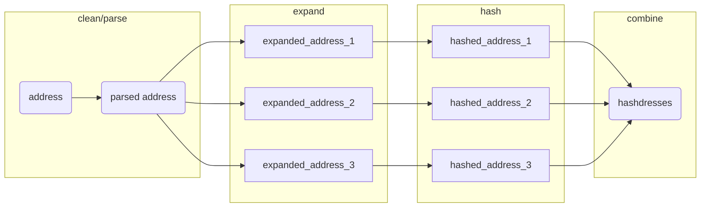

# parcel

<!-- badges: start -->
[](https://github.com/geomarker-io/parcel/actions/workflows/R-CMD-check.yaml)
<!-- badges: end -->

> This package relies on system calls to [Docker](https://www.docker.com/), which must be installed and available.

The goal of parcel is to provide tools for matching real-world addresses to reference sets of addresses. 

Address matching is completed by calculating the "hashdress", in which an address is cleaned, parsed into components, combined into a "parsed_address", and 'expanded' into all possible addresses based on abbreviations. (See the [DeGAUSS](https://degauss.org) [postal](https://github.com/degauss-org/postal#geomarker-methods) container for details.) The cleaned, parsed, and expanded addresses are then each hashed to create a unique set of hashdress identifers for a specific address, termed "hashdresses":



This allows the matching of an address like "352 Helen Street" to "352 Helen St." or "352 helen st". This type of address matching can be used to match addresses in collected data to a set of addresses with parcel identifiers obtained from a county auditor, or other open/commercial datasets describing the conditions specific to a parcel of land.

With this specific goal in mind, parcel includes:

- **`hashdress()`**: a function to clean, normalize, expand, and hash addresses 
- **`cagis_hashdresses`**: a reference address-parcel set of hashdresses for Hamilton County, OH
- **`add_parcel_id()`**: a function to directly add parcel identifers to addresses in Hamilton County, OH based on the parsed street number and street name 
- **`cagis_parcels`**: parcel-specific county auditor tax data that can be linked using the parcel identifier

## Installation

You can install the development version of parcel with:

``` r
renv::install("geomarker-io/parcel")
```

## Example

``` r
library(parcel)

data.frame(address = c(
  "3937 Rose Hill Ave Cincinnati OH 45229",
  "424 Klotter Ave Cincinnati OH 45214",
  "3328 Bauerwoods Dr Cincinnati OH 45251"
)) |>
  add_parcel_id() |>
  tidyr::unnest(cols = c(parcel_id))

#> parsing addresses...
#> expanding addresses...
#> # A tibble: 3 × 14
#> address     parce…¹ prope…² prope…³ prope…⁴ marke…⁵ land_…⁶ acreage homes…⁷ RED_2…⁸ annua…⁹ unpai…˟ parce…˟ parce…˟
#> <chr>       <chr>   <chr>   <chr>   <chr>     <dbl> <fct>     <dbl> <lgl>   <lgl>     <dbl>   <dbl>   <dbl>   <dbl>
#> 1 3937 Rose … 111000… 3937    ROSE H… AV       366930 single…   0.437 FALSE   TRUE      8772.       0   -84.5    39.2
#> 2 424 Klotte… 096000… 424     KLOTTER AV        75000 reside…   0.103 FALSE   FALSE     1874.       0   -84.5    39.1
#> 3 3328 Bauer… 510009… 3328    BAUERW… DR       189990 two fa…   0.467 FALSE   TRUE      5413.       0   -84.6    39.2
#> # … with abbreviated variable names ¹​parcel_id, ²​property_addr_number, ³​property_addr_street, ⁴​property_addr_suffix,
#> #   ⁵​market_total_value, ⁶​land_use, ⁷​homestead, ⁸​RED_25_FLAG, ⁹​annual_taxes, ˟​unpaid_taxes, ˟​parcel_centroid_lon,
#> #   ˟​parcel_centroid_lat
```

## Example CAGIS Parcels Data Details

#### Inclusion/Exclusion Criteria for Parcel Data

Auditor parcel-level data were excluded if they (1) did not contain a parcel identifier, (2) did not contain a property address number, or (3) were complete duplicates.

Parcels with the following land use categories are included in the data resource and others are excluded.  These were selected to reflect *residential* usages of parcels.

|land_use                        |      n|
|:-------------------------------|------:|
|single family dwelling          | 212,059|
|residential vacant land         |  24,585|
|condominium unit                |  19,731|
|two family dwelling             |  11,502|
|apartment, 4-19 units           |   5,664|
|landominium                     |   3,028|
|three family dwelling           |   1,889|
|charities, hospitals, retir     |   1,479|
|condo or pud garage             |    985|
|condominium office building     |    905|
|other residential structure     |    885|
|metropolitan housing authority  |    743|
|apartment, 40+ units            |    562|
|apartment, 20-39 units          |    464|
|office / apartment over         |    193|
|boataminium                     |    141|
|manufactured home               |    110|
|other commercial housing        |    100|
|nursing home / private hospital |     94|
|mobile home / trailer park      |     38|
|independent living (seniors)    |     35|
|lihtc res                       |     25|
|resid unplat 10-19 acres        |     11|
|resid unplat 20-29 acres        |      5|
|resid unplat 30-39 acres        |      2|
|single fam dw 0-9 acr           |      1|

#### Estimating the number of households per parcel

We assume the following number of households per parcel.  (This is used in any calculation needs to be weighted by households instead of parcel; e.g. "What fraction of families live near roadway in Avondale?")

|land_use                        |n_households|
|:-------------------------------|------:|
|single family dwelling          |1|
|condominium unit                |1|
|two family dwelling             |2|
|three family dwelling           |3|
|apartment, 4-19 units           |4|
|apartment, 20-39 units          |20|
|apartment, 40+ units            |40|
|landominium                     |1|
|charities, hospitals, retir     |1|
|condo or pud garage             |1|
|metropolitan housing authority  |1|
|office / apartment over         |1|
|manufactured home               |1|
|other commercial housing        |1|
|nursing home / private hospital |1|
|mobile home / trailer park      |1|
|single fam dw 0-9 acr           |1|
|independent living (seniors)    |1|
|lihtc res                       |1|
|condominium office building     |0|
|other residential structure     |0|
|boataminium                     |0|
|resid unplat 10-19 acres        |0|
|resid unplat 20-29 acres        |0|
|resid unplat 30-39 acres        |0|
|residential vacant land         |0|

#### Identifiers for Parcels and Properties

A `parcel_id` refers to the Hamilton County Auditor's "Parcel Number", which is referred to as the "Property Number" within the CAGIS Open Data and uniquely identifies properties. In rare cases, multple addresses can share the same parcel boundaries, but have unique `parcel_id`s and in these cases, their resulting centroid coordinates would also be identical.

Because "second line" address components (e.g., "Unit 2B") are not captured, a single address can refer to multiple parcels in the case of condos or otherwise shared building ownership. For example, the address "323 Fifth St" has six distinct `parcel_id`s, each with different home values and land uses:

|parcel_id   | market_total_value|land_use                    |
|:-----------|------------------:|:---------------------------|
|14500010321 |             397500|condominium unit            |
|14500010317 |             123000|condominium office building |
|14500010320 |             180000|condominium unit            |
|14500010319 |             255000|condominium unit            |
|14500010322 |             388230|condominium unit            |
|14500010318 |             239500|condominium unit            |

