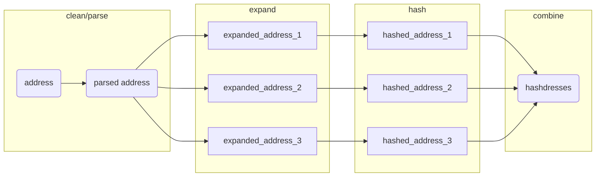

# parcel

<!-- badges: start -->
<!-- badges: end -->

> This package relies on system calls to [Docker](https://www.docker.com/), which must be installed and available.

The goal of parcel is to provide tools for matching real-world addresses to reference sets of addresses. 

Address matching is completed by calculating the "hashdress", in which an address is cleaned, parsed into components, combined into a "parsed_address", and 'expanded' into all possible addresses based on abbreviations. (See the [DeGAUSS](https://degauss.org) [postal](https://github.com/degauss-org/postal#geomarker-methods) container for details.) The cleaned, parsed, and expanded addresses are then each hashed to create a unique set of hashdress identifers for a specific address, termed "hashdresses":



This allows the matching of an address like "352 Helen Street" to "352 Helen St." or "352 helen st". This type of address matching can be used to match addresses in collected data to a set of addresses with parcel identifiers obtained from a county auditor, or other open/commercial datasets describing the conditions specific to a parcel of land.

With this specific goal in mind, parcel includes:

- **`hashdress()`**: a function to clean, normalize, expand, and hash addresses 
- **`cagis_hashdresses`**: a reference address-parcel set of hashdresses for Hamilton County, OH (including parcel-specific county auditor tax data)
- **`add_parcel_id()`**: a function to directly add parcel identifers to addresses in Hamilton County, OH based on the parsed street number and street name 

## Installation

You can install the development version of parcel like so:

``` r
renv::install("geomarker-io/parcel")
```

## Example

``` r
library(parcel)

data.frame(address = c(
  "3937 Rose Hill Ave Cincinnati OH 45229",
  "424 Klotter Ave Cincinnati OH 45214",
  "3328 Bauerwoods Dr Cincinnati OH 45251"
)) |>
  add_parcel_id() |>
  tidyr::unnest(cols = c(parcel_id))

#> parsing addresses...
#> expanding addresses...
#> # A tibble: 3 × 2
#>   address                                parcel_id
#>   <chr>                                  <chr>
#> 1 3937 Rose Hill Ave Cincinnati OH 45229 1110003000600
#> 2 424 Klotter Ave Cincinnati OH 45214    0960003015900
#> 3 3328 Bauerwoods Dr Cincinnati OH 45251 5100093011200
```

