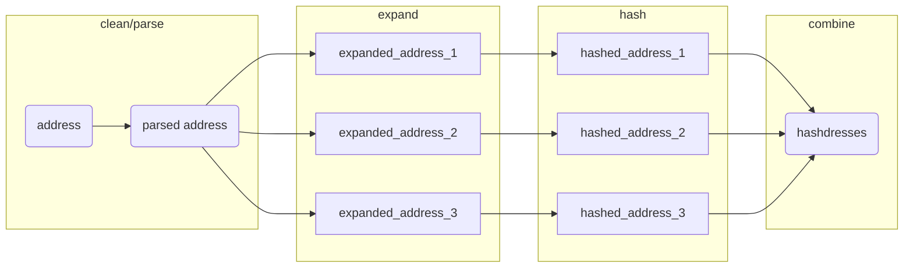

# parcel

<!-- badges: start -->
[](https://github.com/geomarker-io/parcel/actions/workflows/R-CMD-check.yaml)
[](https://lifecycle.r-lib.org/articles/stages.html#experimental)
<!-- badges: end -->


The goal of parcel is to provide tools for matching real-world addresses to reference sets of addresses; e.g., "352 Helen Street", "352 Helen St." or "352 helen st". This package is motivated by the included example data resource of auditor parcel tax data from Hamilton County, Ohio.

With this specific goal in mind, parcel includes:

- **`tag_address()`**: 
- **`create_address_stub()`**: create addresses based on street numbers and names for matching to CAGIS parcel data
- **`expand_address()`**: to expand addresses based on abbreviations using the postal Docker container
- **`hashdress()`**: hash expanded address lists created by `expand_address()`
- **`cagis_hashdresses`**: a reference address-parcel set of hashdresses for Hamilton County, OH
- **`add_parcel_id()`**: add CAGIS parcel ID using the hashdress method

Address matching can be completed via two methods: hashdress and deduplication

## Hashdress

Address matching is completed by calculating the "hashdress", in which an address is cleaned, parsed into components, combined into a "parsed_address", and 'expanded' into all possible addresses based on abbreviations. (See the [DeGAUSS](https://degauss.org) [postal](https://github.com/degauss-org/postal#geomarker-methods) container for details.) The cleaned, parsed, and expanded addresses are then each hashed to create a unique set of hashdress identifers for a specific address, termed "hashdresses":



## Deduplication

See an example script for this approach in the package (`fs::path_package("parcel", "csvlink.R")`)

## Installation

> This package relies on system calls to [Docker](https://www.docker.com/), which must be installed and available.

You can install the development version of parcel with:

``` r
renv::install("geomarker-io/parcel")
```

## CAGIS Parcels Data Details

The CAGIS Parcels tabular data resource is created using the `1_make_cagis_parcels.R` script and stored in the package.  It can be loaded using {[`CODECtools`](https://geomarker.io/CODECtools)}:

```r
CODECtools::read_tdr_csv(fs::path_package("parcel", "cagis_parcels"))

# without CODECtools:
# read.csv(fs::path_package("parcel", "cagis_parcels"))
```

### Inclusion/Exclusion Criteria for Parcel Data

Auditor parcel-level data were excluded if they (1) did not contain a parcel identifier, (2) did not contain a property address number/name, or (3) were complete duplicates.

Parcels with the following land use categories are included in the data resource and others are excluded.  These were selected to reflect *residential* usages of parcels.

|land_use                        |      n|
|:-------------------------------|------:|
|single family dwelling          | 212,059|
|residential vacant land         |  24,585|
|condominium unit                |  19,731|
|two family dwelling             |  11,502|
|apartment, 4-19 units           |   5,664|
|landominium                     |   3,028|
|three family dwelling           |   1,889|
|charities, hospitals, retir     |   1,479|
|condo or pud garage             |    985|
|condominium office building     |    905|
|other residential structure     |    885|
|metropolitan housing authority  |    743|
|apartment, 40+ units            |    562|
|apartment, 20-39 units          |    464|
|office / apartment over         |    193|
|boataminium                     |    141|
|manufactured home               |    110|
|other commercial housing        |    100|
|nursing home / private hospital |     94|
|mobile home / trailer park      |     38|
|independent living (seniors)    |     35|
|lihtc res                       |     25|
|resid unplat 10-19 acres        |     11|
|resid unplat 20-29 acres        |      5|
|resid unplat 30-39 acres        |      2|
|single fam dw 0-9 acr           |      1|

### Estimating the number of households per parcel

We assume the following number of households per parcel.  (This is used in any calculation needs to be weighted by households instead of parcel; e.g. "What fraction of families live near roadway in Avondale?")

|land_use                        |n_households|
|:-------------------------------|------:|
|single family dwelling          |1|
|condominium unit                |1|
|two family dwelling             |2|
|three family dwelling           |3|
|apartment, 4-19 units           |4|
|apartment, 20-39 units          |20|
|apartment, 40+ units            |40|
|landominium                     |1|
|charities, hospitals, retir     |1|
|condo or pud garage             |1|
|metropolitan housing authority  |1|
|office / apartment over         |1|
|manufactured home               |1|
|other commercial housing        |1|
|nursing home / private hospital |1|
|mobile home / trailer park      |1|
|single fam dw 0-9 acr           |1|
|independent living (seniors)    |1|
|lihtc res                       |1|
|condominium office building     |0|
|other residential structure     |0|
|boataminium                     |0|
|resid unplat 10-19 acres        |0|
|resid unplat 20-29 acres        |0|
|resid unplat 30-39 acres        |0|
|residential vacant land         |0|

### Identifiers for Parcels and Properties

A `parcel_id` refers to the Hamilton County Auditor's "Parcel Number", which is referred to as the "Property Number" within the CAGIS Open Data and uniquely identifies properties. In rare cases, multple addresses can share the same parcel boundaries, but have unique `parcel_id`s and in these cases, their resulting centroid coordinates would also be identical.

Because "second line" address components (e.g., "Unit 2B") are not captured, a single address can refer to multiple parcels in the case of condos or otherwise shared building ownership. For example, the address "323 Fifth St" has six distinct `parcel_id`s, each with different home values and land uses:

|parcel_id   | market_total_value|land_use                    |
|:-----------|------------------:|:---------------------------|
|14500010321 |             397500|condominium unit            |
|14500010317 |             123000|condominium office building |
|14500010320 |             180000|condominium unit            |
|14500010319 |             255000|condominium unit            |
|14500010322 |             388230|condominium unit            |
|14500010318 |             239500|condominium unit            |

