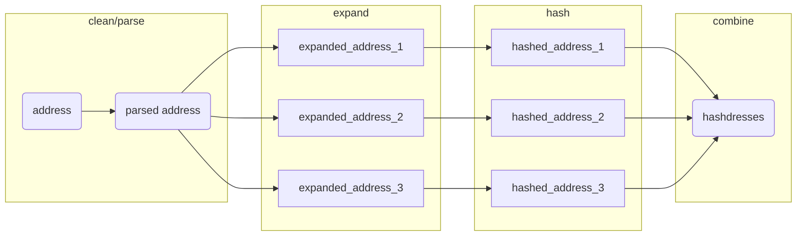

# parcel

<!-- badges: start -->
<!-- badges: end -->

> This package relies on system calls to [Docker](https://www.docker.com/), which must be installed and available.

The goal of parcel is to provide tools for matching real-world addresses to reference sets of addresses. 

Address matching is completed by calculating the "hashdress", in which an address is cleaned, parsed into components, combined into a "parsed_address", and 'expanded' into all possible addresses based on abbreviations. (See the [DeGAUSS](https://degauss.org) [postal](https://github.com/degauss-org/postal#geomarker-methods) container for details.) The cleaned, parsed, and expanded addresses are then each hashed to create a unique set of hashdress identifers for a specific address, termed "hashdresses":



This allows, for example, the "fuzzy" matching of addresses like

-  "352 Helen Street", "352 Helen St.", "352 helen st"
- "5377 Bahama terrace 45223", "5377 Bahama ter", "537 Bahama Te"

Address matching can be used, for example, to match addresses in collected data to a set of addresses with parcel identifiers obtained from a county auditor, or other open/commercial datasets describing the conditions specific to a parcel of land.

With this specific goal in mind, parcel includes:

- tools for address cleaning, normalization, expansion, and hashing addresses (`address_expand()`)
- functions for matching addresses to any reference address set (`address_match()`)
- a reference address-parcel set of hashdresses for Hamilton County, OH (`cagis_hashdresses`)
  - including parcel-specific county auditor tax data
  - including functions to directly add parcel identifer based on addresses in Hamilton County, OH

## Installation

You can install the development version of parcel like so:

``` r
renv::install("geomarker-io/parcel")
```

## Example

``` r
library(parcel)
## basic example code
```

