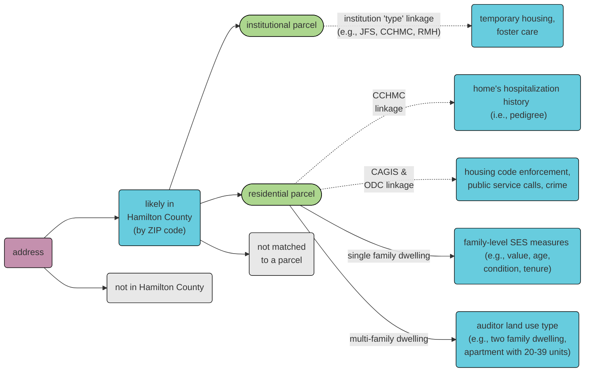

<!-- README.md is generated from README.Rmd. Please edit that file -->

# parcel

<!-- badges: start -->

[](https://github.com/geomarker-io/parcel/actions/workflows/R-CMD-check.yaml)
<!-- badges: end -->

The goal of parcel is to provide tools for matching real-world addresses
to reference sets of addresses; e.g., “352 Helen Street”, “352 Helen
St.” or “352 helen st”. This package is motivated by the included
example data resources of auditor parcel tax data from Hamilton County,
Ohio.

With this specific goal in mind, parcel includes:

- functions for cleaning and tagging components of addresses:
  **`clean_address()`**, **`tag_address()`**, and
  **`create_address_stub()`**
- the `cagis_parcels` tabular-data-resource, which contains parcel
  identifiers, parcel addresses, and parcel characteristics downloaded
  from the [Cincinnati Area Geographic Information System
  (CAGIS)](https://cagismaps.hamilton-co.org/cagisportal/mapdata/download)
- the `hamilton_online_parcels` tabular-data-resource, which contains
  parcel characteristics scraped from [Hamilton County Auditor
  Online](https://wedge1.hcauditor.org/)
- functions for joining addresses to parcel identifiers based on an
  included model pretrained on electronic health record addresses in
  Hamilton County, OH: **`link_parcel()`**
- fs::path_package(“parcel”, “cagis_parcels”) \|\> codec::read_tdr_csv()

## Installation

{parcel} requires the `usaddress` python module for tagging addresses
and creating address stubs, as well as the `dedupe` and
`dedupe-variable-address` python modules for matching addresses, all of
which can be installed from inside R with:

``` r
reticulate::py_install("usaddress", pip = TRUE)
reticulate::py_install("dedupe", pip = TRUE)
reticulate::py_install("dedupe-variable-address", pip = TRUE)
```

The development version of parcel can be installed with:

``` r
renv::install("geomarker-io/parcel")
```

## Example Usage

Use `get_parcel_data()` to get the corresponding parcel data for a
vector of addresses:

``` r
library(parcel)
get_parcel_data(c("1069 Overlook Avenue Cincinnati OH 45238",
                  "419 Elm St. Cincinnati OH 45238",
                  "3544 Linwood Av Cincinnati OH 45226"))
#> # A tibble: 3 × 17
#>   input_address              parcel_id score parcel_address property_addr_number
#>   <chr>                      <chr>     <dbl> <chr>          <chr>               
#> 1 1069 Overlook Avenue Cinc… 1800A800… 0.845 1069 OVERLOOK… 1069                
#> 2 419 Elm St. Cincinnati OH… 54000410… 0.864 419 ELM ST     419                 
#> 3 3544 Linwood Av Cincinnat… 01900010… 0.864 3544 LINWOOD … 3544                
#> # ℹ 12 more variables: property_addr_street <chr>, property_addr_suffix <chr>,
#> #   condo_id <chr>, condo_unit <chr>, parcel_centroid_lat <dbl>,
#> #   parcel_centroid_lon <dbl>, market_total_value <dbl>, land_use <fct>,
#> #   acreage <dbl>, homestead <lgl>, rental_registration <lgl>,
#> #   RED_25_FLAG <lgl>
```

### Python, `miniconda`, and `virtualenv`

`reticulate::py_install()` assumes a non-system version of Python is
already installed and will offer to install Miniconda and create an
environment specifically for R and the reticulate package.

As an alternative to miniconda, it is possible to create a virtualenv
using reticulate:

``` r
library(reticulate)
install_python("3.9.12")
virtualenv_create("r-parcel", version = "3.9.12")
use_virtualenv("r-parcel")
py_install("usaddress", pip = TRUE)
py_module_available("usaddress")
```

To help R find this virtualenv for every session, either
`use_virtualenv("r-parcel")` should be run in every R session *or*,
better yet, by setting the `RETICULATE_PYTHON` environment variable in a
user- or project-specific `.Renviron` file. You can check on which
python installation chosen to be used by reticulate and why by using:

``` r
reticulate::py_config()
reticulate::py_list_packages()
```

## CAGIS Parcels Data Details

The CAGIS Parcels tabular data resource is created using the
`01_make_cagis_parcels.R` script and stored in the package. It can be
loaded using {[`codec`](https://geomarker.io/codec)}:

``` r
d_parcel <- codec::read_tdr_csv(fs::path_package("parcel", "cagis_parcels"))

head(d_parcel)
#> # A tibble: 6 × 15
#>   parcel_id     parcel_address       property_addr_number property_addr_street
#>   <chr>         <chr>                <chr>                <chr>               
#> 1 6210024007000 210 CARRINGTON PL    210                  CARRINGTON          
#> 2 6210024009200 220 CARRINGTON PL    220                  CARRINGTON          
#> 3 6210024007100 210 CARRINGTON PL    210                  CARRINGTON          
#> 4 6210024008200 220 CARRINGTON PL    220                  CARRINGTON          
#> 5 5000122021500 8053 WITTS MILL LN   8053                 WITTS MILL          
#> 6 5000122020900 8120 WITTS MEADOW LN 8120                 WITTS MEADOW        
#> # ℹ 11 more variables: property_addr_suffix <chr>, condo_id <chr>,
#> #   condo_unit <chr>, parcel_centroid_lat <dbl>, parcel_centroid_lon <dbl>,
#> #   market_total_value <dbl>, land_use <fct>, acreage <dbl>, homestead <lgl>,
#> #   rental_registration <lgl>, RED_25_FLAG <lgl>

# without CODECtools:
# read.csv(fs::path_package("parcel", "cagis_parcels"))
```

``` r
options(knitr.kable.NA = '')
codec::glimpse_schema(d_parcel) |>
  knitr::kable()
```

| name                 | title                     | description                                                    | type    | constraints                                                                                                                                                                                                                                                                                                                                                                                                                                                                    |
|:---------------------|:--------------------------|:---------------------------------------------------------------|:--------|:-------------------------------------------------------------------------------------------------------------------------------------------------------------------------------------------------------------------------------------------------------------------------------------------------------------------------------------------------------------------------------------------------------------------------------------------------------------------------------|
| parcel_id            | Parcel Identifier         | uniquely identifies properties; the auditor Parcel Number      | string  |                                                                                                                                                                                                                                                                                                                                                                                                                                                                                |
| parcel_address       | Parcel Address            | derived by pasting Property Address Number, Street, and Suffix | string  |                                                                                                                                                                                                                                                                                                                                                                                                                                                                                |
| property_addr_number | Address Number            |                                                                | string  |                                                                                                                                                                                                                                                                                                                                                                                                                                                                                |
| property_addr_street | Address Street            |                                                                | string  |                                                                                                                                                                                                                                                                                                                                                                                                                                                                                |
| property_addr_suffix | Address Suffix            |                                                                | string  |                                                                                                                                                                                                                                                                                                                                                                                                                                                                                |
| condo_id             | Condo identifier          | used to match two parcels to the same building of condos       | string  |                                                                                                                                                                                                                                                                                                                                                                                                                                                                                |
| condo_unit           | Condo unit                | specifies a specific unit within a building of condos          | string  |                                                                                                                                                                                                                                                                                                                                                                                                                                                                                |
| parcel_centroid_lat  | Parcel Centroid Latitude  | coordinates derived from centroid of parcel shape              | number  |                                                                                                                                                                                                                                                                                                                                                                                                                                                                                |
| parcel_centroid_lon  | Parcel Centroid Longitude | coordinates derived from centroid of parcel shape              | number  |                                                                                                                                                                                                                                                                                                                                                                                                                                                                                |
| market_total_value   | Market Total Value        |                                                                | number  |                                                                                                                                                                                                                                                                                                                                                                                                                                                                                |
| land_use             |                           |                                                                | string  | apartment, 4-19 units, apartment, 20-39 units, apartment, 40+ units, nursing home / private hospital, independent living (seniors), mobile home / trailer park, other commercial housing, office / apartment over, single family dwelling, two family dwelling, three family dwelling, condominium unit, boataminium, condo or pud garage, landominium, manufactured home, lihtc res, other residential structure, metropolitan housing authority, charities, hospitals, retir |
| acreage              | Acreage                   |                                                                | number  |                                                                                                                                                                                                                                                                                                                                                                                                                                                                                |
| homestead            | Homestead                 |                                                                | boolean |                                                                                                                                                                                                                                                                                                                                                                                                                                                                                |
| rental_registration  | Rental Registration       |                                                                | boolean |                                                                                                                                                                                                                                                                                                                                                                                                                                                                                |
| RED_25_FLAG          |                           |                                                                | boolean |                                                                                                                                                                                                                                                                                                                                                                                                                                                                                |

Some of the parcel characteristics do not make sense in certain contexts
and should not be interpreted incorrectly; for example, the value of a
parcel for a multi-family or multi-unit housing structure shouldn’t be
compared to the value of a parcel for a single-family household for the
purposes of assesing individual-level SES. Within the process of
matching to a parcel, an individual address could be merged with
differing types and resolutions of data:



### Inclusion/Exclusion Criteria for Parcel Data

Auditor parcel-level data were excluded if they (1) did not contain a
parcel identifier, (2) did not contain a property address number/name,
or (3) had a duplicated parcel identifier.

Parcels with the following land use categories are included in the data
resource and others are excluded. These were selected to reflect
*residential* usages of parcels.

``` r
library(dplyr, warn.conflicts = FALSE)

d_parcel |>
  group_by(land_use) |>
  summarize(n_parcels = n()) |>
  arrange(desc(n_parcels)) |>
  knitr::kable()
```

| land_use                        | n_parcels |
|:--------------------------------|----------:|
| single family dwelling          |    213044 |
| condominium unit                |     19754 |
| two family dwelling             |     11352 |
| apartment, 4-19 units           |      5659 |
| landominium                     |      3047 |
| three family dwelling           |      1863 |
| charities, hospitals, retir     |      1430 |
| condo or pud garage             |      1063 |
| other residential structure     |       875 |
| metropolitan housing authority  |       744 |
| apartment, 40+ units            |       625 |
| apartment, 20-39 units          |       457 |
| manufactured home               |       204 |
| office / apartment over         |       188 |
| boataminium                     |       141 |
| other commercial housing        |        99 |
| nursing home / private hospital |        94 |
| mobile home / trailer park      |        40 |
| independent living (seniors)    |        38 |
| lihtc res                       |        25 |

### Estimating the number of households per parcel

Certain calculations needs to be weighted by households instead of
parcel; e.g. “What fraction of families live near roadway in Avondale?”.
We assume the following as a conservative estimate of the number of
households per parcel for each `land_use` code:

| `land_use`                      | n households |
|:--------------------------------|-------------:|
| single family dwelling          |            1 |
| condominium unit                |            1 |
| two family dwelling             |            2 |
| three family dwelling           |            3 |
| apartment, 4-19 units           |            4 |
| apartment, 20-39 units          |           20 |
| apartment, 40+ units            |           40 |
| landominium                     |            1 |
| charities, hospitals, retir     |            1 |
| condo or pud garage             |            1 |
| metropolitan housing authority  |            1 |
| office / apartment over         |            1 |
| manufactured home               |            1 |
| other commercial housing        |            1 |
| nursing home / private hospital |            1 |
| mobile home / trailer park      |            1 |
| single fam dw 0-9 acr           |            1 |
| independent living (seniors)    |            1 |
| lihtc res                       |            1 |
| condominium office building     |            0 |
| other residential structure     |            0 |
| boataminium                     |            0 |

### Identifiers for Parcels and Properties

A `parcel_id` refers to the Hamilton County Auditor’s “Parcel Number”,
which is referred to as the “Property Number” within the CAGIS Open Data
and uniquely identifies properties. In rare cases, multple addresses can
share the same parcel boundaries, but have unique `parcel_id`s and in
these cases, their resulting centroid coordinates would also be
identical.

Because “second line” address components (e.g., “Unit 2B”) are not
captured, a single address can refer to multiple parcels in the case of
condos or otherwise shared building ownership. For example, the address
“323 Fifth St” has six distinct `parcel_id`s, each with different home
values and land uses:

| parcel_id   | market_total_value | land_use                    |
|:------------|-------------------:|:----------------------------|
| 14500010321 |             397500 | condominium unit            |
| 14500010317 |             123000 | condominium office building |
| 14500010320 |             180000 | condominium unit            |
| 14500010319 |             255000 | condominium unit            |
| 14500010322 |             388230 | condominium unit            |
| 14500010318 |             239500 | condominium unit            |
